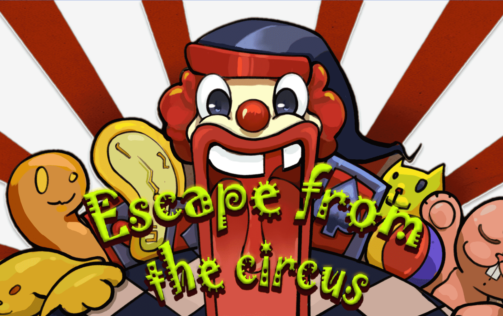
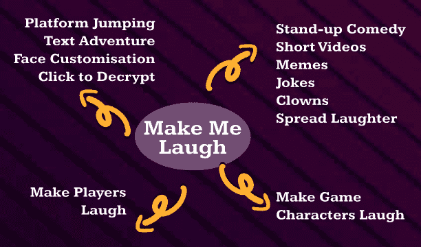
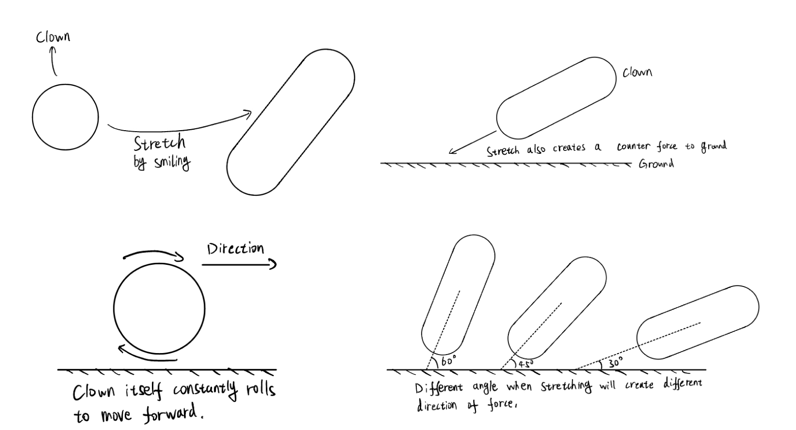

# Escape From the Circus

## Background Story

Once upon a time, there was a clown who was enslaved by a sinister circus and performed dangerous and comical performances every day. One day, he decided to escape from this sinister circus.

## Brainstorm

When we encountered the theme "Make Me Laugh," we posed three questions: Who makes "me" laugh? How? And who am I? We realized that if someone needs laughter, they're likely feeling upset or unhappy. Thus, "I" am someone discontented.

Clowns often embody this sentiment, portrayed as sad figures in various media, like the Joker. This led us to choose a clown as our character—someone who traditionally makes others laugh but struggles to find joy themselves.

With "I" defined as a clown, it became clear that in reality, clowns rarely receive laughter from others; they must find laughter within themselves. Our game builds on this concept, encouraging players to laugh on their own, turning the act of laughing into a self-driven experience.

## Gameplay Design

We modeled our character's movements after "Hopping Head," discovered by our 2D artist in an ad. Realizing the character resembled a smiling person, we integrated this design with facial recognition for our gameplay.

Players use a camera to control the game. The clown moves continuously, and players smile at the camera to make the clown smile and stretch, which helps navigate obstacles. Smiling triggers the camera to detect the smile and stretch the clown, providing a counterforce for jumping. The character, normally a rolling circle, moves forward automatically, simplifying control and reducing difficulty.

